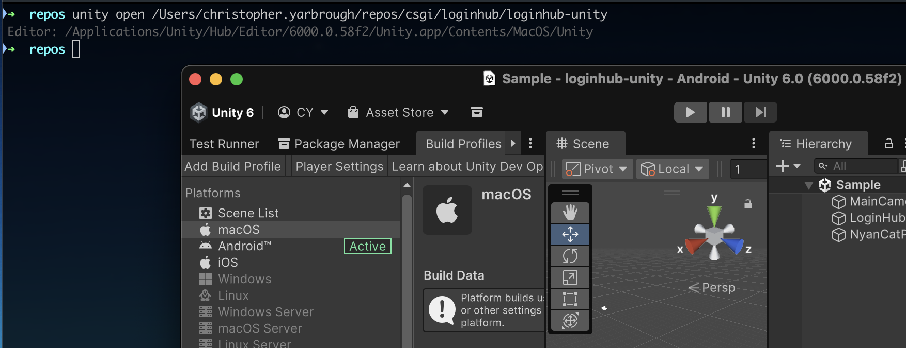

# Unity Command Line Launcher

A terminal command to open Unity projects quickly from the command line.



## Supported Platforms

- macOS
- Windows
- Linux

## Commands

| Name                           | Description                                                                 |
|--------------------------------|-----------------------------------------------------------------------------|
| `open [path]`                  | Opens the Unity editor by searching for a project within path.              |
| `open`                         | Shows a selection prompt of recent or favorite projects from the Unity Hub. |
| `install [version]`            | Installs the Editor by version, fetching the revision, if necessary.        |
| `install-missing`              | Installs all Unity versions used by projects but not installed.             |
| `uninstall-unused`             | Uninstalls all Unity versions not used by any projects.                     |
| `editor-revision [version]`    | Fetches the revision from Unity's API.                                      |
| `editor-path [version]`        | Gets the installation directory of the Editor, if installed.                |
| `project-version <path>`       | Gets the Unity version information from a project.                          |
| `project-path [path]`          | Gets the Unity project root directory from a search path.                   |
| `projects-using [version]`     | Finds all projects that use a specific Unity version.                       |
| `version-usage`                | Lists installed Unity versions and indicates which are used.                |
| `create <directory> [version]` | Creates a new empty Unity project in the directory.                         |
| `upm-git-url [path]`           | Generates a package git URL for Unity Package Manager from a project.       |
| `hub`                          | Executes Unity Hub interactively or with additional CLI arguments.          |

`path` can be a ProjectVersion.txt file or a directory (searches up and down for projects).
If a directory contains multiple Unity projects, an interactive prompt will request a single selection.

If `path` is omitted, it can be selected interactively from a prompt that shows recent projects from the Unity Hub.
Add the `--favorite` flag to show favorites instead.

If the `version` argument is omitted, an interactive prompt shows all installed editor versions.

---

## Installation

### From Source (recommended)

1. Clone the repository.
2. Checkout a release tag and take note of the signature, e.g. `git tag -v v1.0.0`.
3. Navigate to the project directory:
   ```shell
   cd src/ucll
   ```
4. Produce a binary:
   ```shell
   dotnet publish
   ```
5. Find the binary in e.g. `src/ucll/bin/osx-arm64/publish/`

### Download Binaries

Or, download a binary from the GitHub _Releases_ page.

E.g. for macOS with an M4 Apple processor:
`ucll-osx-arm64.tar.gz`

See [Security.md](Security.md) for instructions on how to verify the authenticity of your download.

## Setup

Create an alias in your shell config (.zshrc, .shellrc, etc.):

```shell
echo 'alias unity="~/UnityCommandLineLauncher/src/ucll/bin/Release/osx-arm64/publish/ucll"' >> ~/.zshrc
```

> The remainder of the guide assumes you have the alias named `unity` to run the `ucll` tool.

Or add the binary location to your PATH variable.

```shell
export PATH=$PATH:~/UnityCommandLineLauncher/src/ucll/bin/Release/osx-arm64/publish/
```

You may need to make the file executable:

```shell
chmod +x ucll
```

### Interaction Selection Prompt

Various commands have optional parameters which show a selection prompt:

- Use the arrow keys to select an item and press Enter to confirm
- Type on the keyboard to start searching.

### Enhanced Fuzzy Search (Optional)

Install [fzf](https://github.com/junegunn/fzf) 0.67.0 or newer:

```shell
brew install fzf
```

With `fzf` installed, the interactive project selection (`unity open`) will use enhanced matching:

- **Acronyms**: `cfp` finds "core-frontend-platform"
- **Typo tolerance**: `sigle-sign` finds "single-sign-on"

Press the ESC key to cancel the prompt.


If `fzf` is not installed, the built-in search will be used as a fallback.
Press CTRL + C to cancel the prompt. Known bug: This will leave the console cursor hidden.

### Unity Hub

- Ensure version 3.15.4 or newer is installed (https://unity.com/download)

---

## Usage

Discover available commands and options:

```shell
unity --help
```

Show more info about a command:

```shell
unity open --help
```

Forward additional arguments to Unity Hub/Editor by separating them with a `--`:

```shell
unity open path/to/project -- -batchmode -quit
```

```shell
unity install 2022.3.10f1 -- --module webgl
```

## Features

- Opens Unity projects from the terminal (faster than using the Unity Hub GUI)
- Interactive project selection from Unity Hub's recent projects (optional favorites filter)
- Detects Unity Editor version from projects
- Installs missing Unity Editor versions via Unity Hub
- Fetches changeset info from Unity API when missing in ProjectVersion.txt (e.g. legacy projects)
- Forwards additional Unity CLI arguments (e.g. `-batchmode -quit`)
- Auto-detects Unity Hub and Editor installation paths

## Configuration

> If Unity Hub and the editors are installed in their default location, there should be no configuration needed.

Installations are detected in the following order:

1. Environment variables (optional, see table below)
2. Default paths on platform
3. Search heuristic to find the paths

Environment variables are optional but speed up execution for non-default installations.

| Platform | Environment Variable Example                                                            |
|----------|-----------------------------------------------------------------------------------------|
| macOS    | `UNITY_EDITOR_PATH="/Applications/Unity/Hub/Editor/{0}/Unity.app/Contents/MacOS/Unity"` |
|          | `UNITY_HUB_PATH="/Applications/Unity Hub.app/Contents/MacOS/Unity Hub"`                 |
|          |                                                                                         |
| Windows  | `UNITY_EDITOR_PATH="C:\Program Files\Unity\Hub\Editor\{0}\Editor\Unity.exe"`            |
|          | `UNITY_HUB_PATH="C:\Program Files\Unity Hub\Unity Hub.exe"`                             |
|          |                                                                                         |
| Linux    | `UNITY_EDITOR_PATH="/home/<user>/Unity/Hub/Editor/{0}/Editor/Unity"`                    |
|          | `UNITY_HUB_PATH="/home/<user>/Applications/Unity Hub.AppImage"`                         |

The placeholder `{0}` is part of the path pattern and will be replaced with the Editor version at runtime.

## Tips & Examples

The command API is intentionally kept simple and (hopefully) logical.
Save your favorite invocations as aliases to make the most out of this tool:

```
alias uo="ucll open --code-editor"
```

With this, opening a Unity project and the IDE in the current directory becomes a breeze:

```
uo .
```

Remember to take advantage of the builtin search to interactively select from multiple projects:

```
uo ~/repos
```

You can use the `project-path` command to cd into a directory (e.g. for updating git in a project) before opening Unity:

```shell
cd $(unity project-path)
```

## Design Background

### Problems

- Unity Hub is slow to open and requires manual project management
- GUI-based workflows are cumbersome for multiple projects
- Unity Hub CLI has limitations: requires hardcoded paths, needs changeset info for installations, requires architecture
  detection on macOS

### Solutions

- Terminal access is faster (global hotkeys, IDE integration, Finder context menu)
- This tool streamlines the Unity Hub API with a better UX

## Development

See the [Developer Readme](src/ucll/DeveloperReadme.md) to see how to build the .NET source.

## Future & Contributions

I consider the API pre version 1.0.0 experimental. Let's collaborate on defining the overall command structure.
Once it has settled a bit and we have automated Docker/VM tests, we can publish a stable release version.

If the tool receives enough stars/forks, we can publish it to _Homebrew_ and similar package managers.
