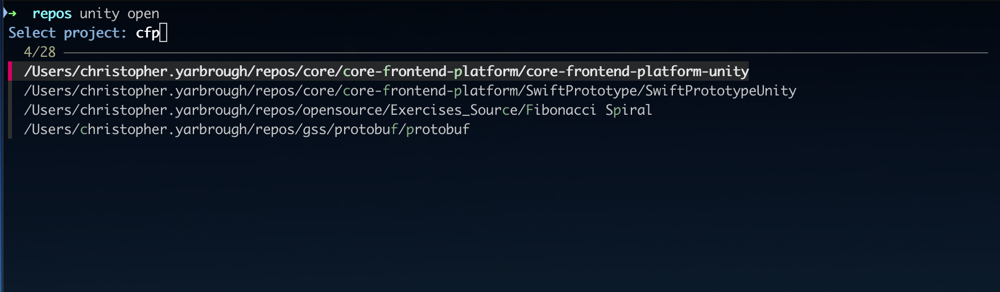

# Unity Command Line Launcher

A terminal command to open Unity projects quickly from the command line.


## Supported Platforms

- macOS (tested with Sequoia 15.7.1)

## Commands

| Name                        | Description                                                          |
|-----------------------------|----------------------------------------------------------------------|
| `open [path]`               | Opens the Unity project.                                             |
| `open`                      | Shows a selection prompt of recent projects from the Unity Hub.      |
| `install <version>`         | Installs the editor by version, fetching the revision, if necessary. |
| `editor-revision <version>` | Fetches the revision from Unity's API.                               |
| `editor-path <version>`     | Gets the installation directory of the editor, if installed.         |
| `project-version <path>`    | Gets the Unity version information from a project.                   |

`path` can be a ProjectVersion.txt file or a directory (searches up and down for projects).
If a directory contains multiple Unity projects, an interactive prompt will request a single selection.

---

## Setup

1. Download the binaries from the releases page or clone the repository.
2. When building from source run `dotnet publish` to publish a binary for your current platform.
3. Create an alias in your shell config (.zshrc, .bashrc, etc.):

```bash
echo 'alias unity="~/UnityCommandLineLauncher/dotnet/ucll/bin/Release/osx-arm64/publish/ucll"' >> ~/.zshrc
```

Or add the binary location to your PATH variable.

```bash
export PATH=$PATH:~/UnityCommandLineLauncher/dotnet/ucll/bin/Release/osx-arm64/publish/
```

### Enhanced Fuzzy Search (Optional)

Install [fzf](https://github.com/junegunn/fzf):

```bash
brew install fzf
```

With `fzf` installed, the interactive project selection (`unity open`) will use enhanced matching:

- **Acronyms**: `cfp` finds "core-frontend-platform"
- **Typo tolerance**: `sigle-sign` finds "single-sign-on"

If `fzf` is not installed, the built-in search will be used as a fallback.



---

## Usage

Discover available commands and options:

```bash
unity --help
```

Show more info about a command:

```bash
unity open --help
```

Forward additional arguments to the Unity editor by separating them with a `--`:

```bash
unity open path/to/project -- -batchmode -quit
```

## Features

- Opens Unity projects from the terminal (faster than using the Unity Hub GUI)
- Interactive project selection from Unity Hub's recent projects (optional favorites filter)
- Detects Unity Editor version from projects
- Installs missing Unity Editor versions via Unity Hub
- Fetches changeset info from Unity API when missing in ProjectVersion.txt (e.g. legacy projects)
- Forwards additional Unity CLI arguments (e.g. `-batchmode -quit`)
- Auto-detects Unity Hub and editor installation paths

## Configuration

Unity Hub and editor installations are detected in the following order:

1. Environment variables (optional, see table below)
2. Default paths on platform
3. Search heuristic to guess the paths

Environment variables are optional but speed up execution for non-default installations.

| Platform | Environment Variable Example                                                            |
|----------|-----------------------------------------------------------------------------------------|
| macOS    | `UNITY_EDITOR_PATH="/Applications/Unity/Hub/Editor/{0}/Unity.app/Contents/MacOS/Unity"` |
|          | `UNITY_HUB_PATH="/Applications/Unity Hub.app/Contents/MacOS/Unity Hub"`                 |
|          |                                                                                         |
| Windows  | `UNITY_EDITOR_PATH="C:\Program Files\Unity\Hub\Editor\{0}\Editor\Unity.exe"`            |
|          | `UNITY_HUB_PATH="C:\Program Files\Unity Hub\Unity Hub.exe"`                             |
|          |                                                                                         |
| Linux    | `UNITY_EDITOR_PATH="/home/<user>/Unity/Hub/Editor/{0}/Editor/Unity"`                    |
|          | `UNITY_HUB_PATH="/home/<user>/Applications/Unity Hub.AppImage"`                         |

The placeholder `{0}` is part of the path pattern and will be replaced with the editor version at runtime.

## Design Background

### Problems

- Unity Hub is slow to open and requires manual project management
- GUI-based workflows are cumbersome for multiple projects
- Unity Hub CLI has limitations: requires hardcoded paths, needs changeset info for installations, requires architecture
  detection on macOS

### Solutions

- Terminal access is faster (global hotkeys, IDE integration, Finder context menu)
- This tool streamlines the Unity Hub API with a better UX

## Development

This repository contains multiple implementations. The dotnet version is officially supported.
The additional experiments can be used as a reference or to copy-paste into your own projects.

See the [Developer Readme](dotnet/ucll/DeveloperReadme.md) for .NET development.

## Future

If the tool receives enough stars/forks, I'll publish it to _Homebrew_ and similar package managers.
